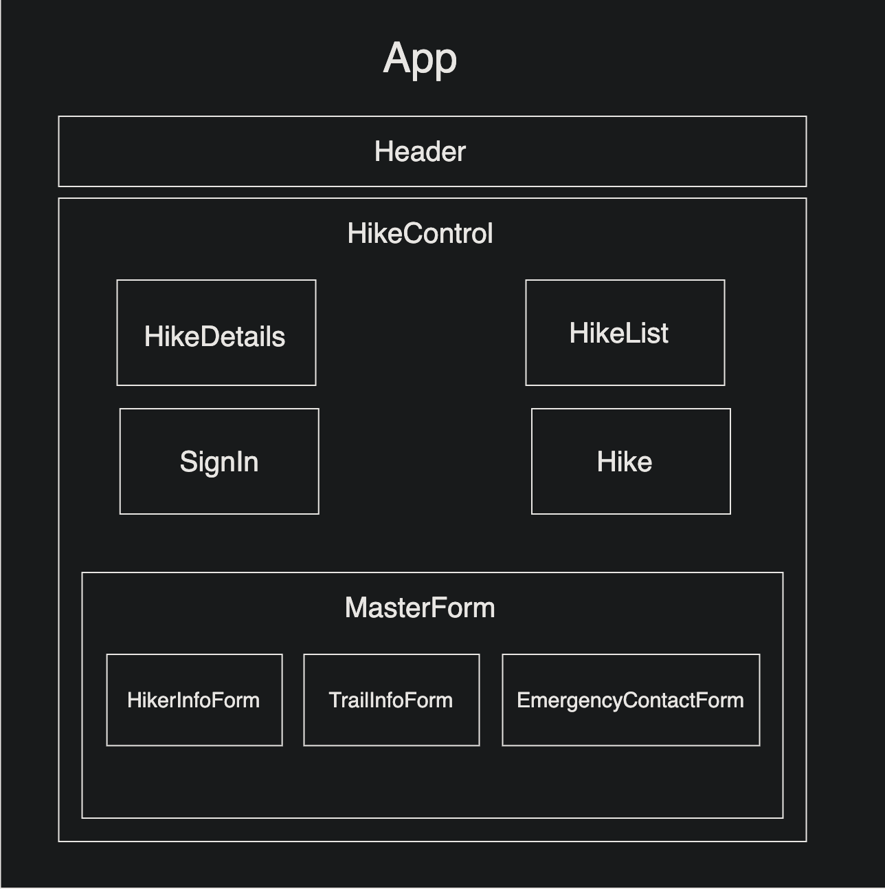

# GoinOffGrid

<h3 align="center">Capstone Project | Initialized: 02-26-2021</h3>
<h4 align="center"> By Agata Kolodziej</h4>

## Description

GoinOffGrid is an accountability app for hikers to streamline their hike information with an emergency contact. The goal is to have a chosen contact be aware and accountable of the hiker's adventure and safe return.

## Component Diagram

Use Case

- Users are primarily hikers who are hiking alone. The unspoken rule when solo hiking is to let one person (emergency contact) know where you are going, in case something were to happen (weather change, natural disaster, health complications, getting lost, stranger danger, car trouble). The difficulty is organizing all the important information the hiker should share with their emergency contact. (location, duration, supplies, conditions). This has resulted in missing hikers, stressful encounters and general anxiety of solo hiking of being "off the grid" instead of enjoying the experience of being off grid, of disconnecting from the daily grind and enjoying solitude in nature.

- The product will provide a form for the user to input the hike information they are wanting to share with their emergency contact.

- The product will inform the hiker's emergency contact with the form information submitted via email.

- The product will allow the user to log when they have completed their hike and safely returned.

- The product will inform the hiker's emergency contact that the hiker has completed their hike and safely returned.

- The product will have a countdown for the duration of user's the hike.

- The product will notify the hiker's emergency contact if the hiker has not logged their return and provide instructions to ensure the hiker is safe. (Instruct emergency contact to contact the hiker, contact the authorities if suspected that the hiker may be in danger or missing).

- The product will allow users/contacts to alleviate the stress of solo hiking.

  
User Stories

**Hiker**

- I want to be able to fill out a form with information about myself, my hike, supplies, and emergency contact information
- I want to be able to have an account to log in and log out
- I want to have a secure account to keep my information private
- I want to be able to have my inputted information accessible to my emergency contact
- I want to be able to log my return from the hike
- I want to have my contact notified if I have not logged my completion of the hike

**Contact**

- I want to be able to view my hikers inputted information
- I want to be notified about the start and estimated return time of my hiker's hike
- I want to be notified about my hikers return from hike

##### Software Requirements

1. Internet browser
2. A code editor such as VSCode to view and edit the code

##### Open Locally

<!-- - Click on the link to my repository: [My Repository](https://github.com/agatakolohe/TapRoom-Redux.git)
- Click on the green "Code" button and copy the repository URL
- Open your terminal and use the command `git clone https://github.com/agatakolohe/TapRoom-Redux.git` into the directory you would like to clone the repository
- Open in text editor to view code and make changes
  - Open terminal and navigate to tap-room directory
  - Use the command `npm install` to download and install all necessary packages for the project to function
  - Use the command `npm install redux@4.0.5 react-redux@7.1.3` to install redux -->

#### View In Browser

<!-- - To Build and view in browser
  - Navigate to TapRoom directory and use the command `npm start`
  - Enjoy the application! -->

## Known Bugs

No known bugs

## Support and Contact Details

If any errors or bugs occur please email me, <agatakolohe@gmail.com>.

## Technologies Used

- Bootstrap
- CSS
- HTML
- Git
- JavaScript ES6
- JSX
- Node
- npm
- React
- VS Code

### License

This software is licensed under the [MIT License](https://choosealicense.com/licenses/mit/).

Copyright (c) 2021 Agata Kolodziej 
